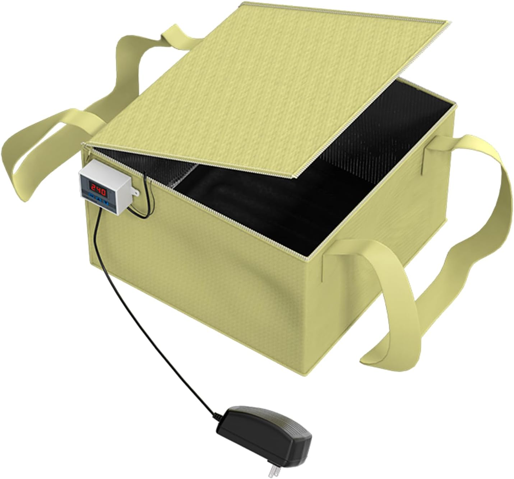
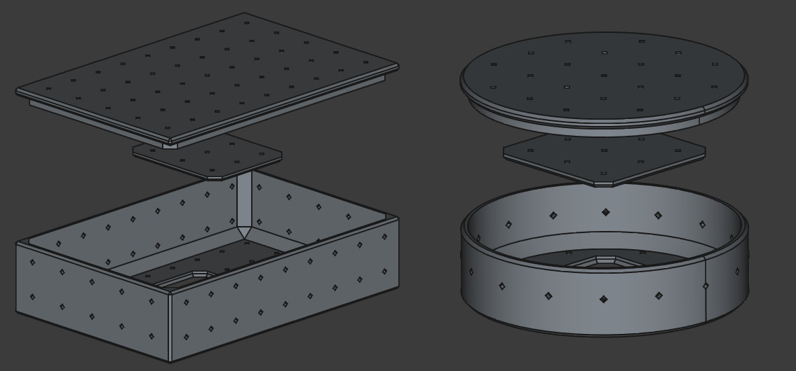

Tempeh. Har du hört talas om det? Det är en traditionell indonesisk
mat gjord av fermenterade sojabönor. Fullproppad med protein och med
en unik, nötig smak är tempeh ett fantastiskt köttalternativ för både
veganer och vegetarianer.

I det här inlägget guidar jag dig genom vad tempeh är, hur man gör det
hemma, och tar upp några av de vanligaste utmaningarna, som att hålla
rätt temperatur under fermenteringen. Så om du någonsin funderat på
att prova att göra tempeh, då kör vi!

---

## Vad är tempeh?

Tempeh görs genom att fermentera bönor med en svampkultur som kallas
[Rhizopus oligosporus](https://en.wikipedia.org/wiki/Rhizopus_oligosporus). När
svampen växer binder den samman bönorna till en fast kaka, som kan
skivas, marineras och tillagas på oändligt många sätt.

Processen är enkel i teorin: blötlägg, koka och fermentera bönorna.
Att hålla temperaturen stabil under fermenteringen kan dock vara
knepigt. Men oroa dig inte, jag delar med mig av mina lösningar
nedan!

Se till att vara redo att ta dig an
[Temperaturproblemet](#temperaturproblemet) och bli kreativ med
[Formar och former](#formar-och-former) för din tempeh.

---

## Så gör du tempeh

### Ingredienser

- **500 g torkade, skalade sojabönor**
  (Andra bönor fungerar också, skalade och delade lupinbönor är ett bra alternativ!)

  *Källa: [Mellins 🇸🇪](https://mellins.nu/produkter/skafferi-torrvaror-smaksattning/baljvaxter/bonor/sojabonor-skalade-obesprutade/)*

- **5 ml (1 tsk) tempeh-starter**

  *Källa: [Mr. Malt 🇸🇪](https://mr-malt.se/jast/fermentering/tempeh-starter-10-g)*

- **75 ml (5 msk) äppelcidervinäger**

### Instruktioner

#### 1. Förbered bönorna

1. Blötlägg bönorna i vatten i minst 8 timmar eller över natten.
2. Skölj dem noggrant med rent vatten.
3. Koka bönorna på låg värme i 40–45 minuter, tills de är mjuka men
   inte geggiga.

#### 2. Torka och kyl bönorna

4. Häll av bönorna väl och lägg tillbaka dem i grytan. Värm försiktigt
   för att få bort överflödigt vatten utan att bränna dem.
5. Blanda i äppelcidervinägern.
6. Bred ut bönorna på en bakplåt så att de svalnar till under 30°C
   (86°F).

#### 3. Tillsätt starterkulturen

7. När bönorna svalnat, blanda i tempeh-startern jämnt.

#### 4. Forma tempehn
8. Packa bönorna i formar efter eget val. (Se [Formar och
   former](#formar-och-former) för idéer.)

#### 5. Fermentera
9. Placera formarna i en värmelåda eller annan temperaturkontrollerad
   miljö. Höj formarna något för att tillåta luftcirkulation.
10. Kontrollera tempehn efter 20 timmar — den bör börja utveckla vit
    mögelpäls. Låt den fermentera i ytterligare 10–15 timmar.

💡 **Obs:** Mindre spår av svart mögel är normalt och inte skadligt.

---

## Felsökning och tips

### Temperaturproblemet

Att hålla rätt temperatur (30–31°C / 86–88°F) under fermenteringen kan
vara knepigt. Jag försökte bygga en egen värmelåda, men den var
opålitlig. Till slut upptäckte jag en "jäsningslåda för bröd", som
fungerar perfekt.

Så här använder jag min:

- **Starttemp (P0):** 29,5°C (85,1°F)
- **Stopptemp (P1):** 31°C (87,8°F)
- **Kalibrering (P2) och fördröjd start (P3):** Båda satta till 0.

När jag placerar tempehn i lådan lägger jag ätpinnar under formarna
för att säkerställa jämn värmefördelning. Jag placerar även
temperaturgivaren nära värmemattan.

*Jäsningslåda för bröd från [Amazon](https://www.amazon.se/dp/B085HTJ8LL)*

---

### Formar och former

Traditionellt sett viras tempeh in i bananblad, men de är inte lätta
att få tag på där jag bor. Istället använder jag två metoder:

1. **Perforerade fryspåsar**
   - Gör jämnt fördelade hål med en gaffel eller tandpetare.

2. **3D-printade formar**
   - Jag designade och printade egna formar för olika tempeh-former.
     [3D-modeller](https://makerworld.com/en/collections/3581445).
   - Dessa är inte livsmedelssäkra men fungerar bra för personligt
     bruk. Om du provar detta, gör det på eget ansvar.

För inspiration, kolla in den här
[Wikifactory-samlingen](https://wikifactory.com/@domingoclub/tempeh-molds).

---

## Avslutande tankar

Att göra tempeh hemma är givande, näringsrikt och förvånansvärt roligt
när man väl har koll på processen. Oavsett om du experimenterar med
olika bönor eller felsöker temperaturproblem, är resan värd det.

Om du har några frågor, lämna gärna en kommentar nedan. Lycka till med
fermenteringen!

---

## Resurser

- [Vad är tempeh?](https://en.wikipedia.org/wiki/Tempeh)
- [Sojabönor från Mellins](https://mellins.nu/produkter/skafferi-torrvaror-smaksattning/baljvaxter/bonor/sojabonor-skalade-obesprutade/)
- [Tempeh-starter från Mr. Malt](https://mr-malt.se/jast/fermentering/tempeh-starter-10-g)
- [Jäsningslåda för bröd på Amazon](https://www.amazon.se/dp/B085HTJ8LL)
