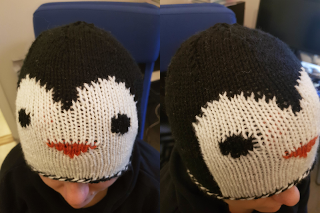
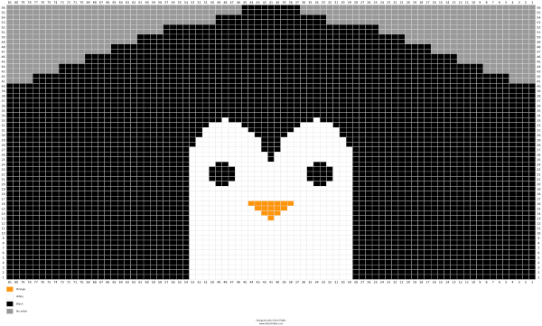
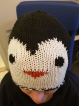
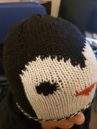
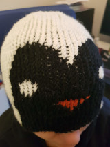

This is a quite unusual post for this blog, it's not what I've expected to
put on here. But I wanted to share it somewhere more permanent than many
other places where I hang out on the internet. So here it goes.

I've been knitting for a bunch of years now, and some years ago I was
intrigued by a knitting method that is called double knitting. In theory it's
fairly simple because you basically make two knitting's at the same time in
parallel and mirror the pattern.

And I haven't tried this before but I wanted to make a penguin beanie. And
I'm pretty happy with the result. It's symmetric so the inside is the inverse
of the outside. And the inside kinda became the evil twin of the outside.

## Pattern chart

[Link to bigger chart](./medium_chart.png). [Link to full pattern](https://www.stitchfiddle.com/en/c/sifm3s-xp37/quickview).

## Pattern description

So this is what I used:

- 3.5mm circular needle
- Black, White and Orange yarn for that needle size

Cast on 162 stitches with black and white at the same time as one thread. I
made sure to have black and white were in the right order. So it was always
black-white repeating for the first 56 stitches. Then I switched to
white-black for 50 stitches and then 56 more black-white ones.

I started with the friendly penguin as outside, so I started with black knits
and white purls. And when I got to the piece with white first I switched the
threads to get a white knit and a black purl. This becomes natural and will
follow the chart above.

When you get to the beak, you should do both knit and purl with orange to get
it on both sides and make sure to transport the white and black yarn between
those two stitches so they aren't visible from any outside. And when you get
sequential rows on the beak you want to backtrack the orange yarn in between
the stitches from previous rows so the yarn ends up at the start of the
segment of the beak, without hanging on the outside of the layers.

When the knitting reaches ~18cm (line 40 in my case), you want to start to
decrease the amount of stitches.

This is done by removing 8 stitches per line every second line (as the chart
above suggests). But they should be spread out evenly around the hat. To make
a single decrease you lift over a black stitch to the right needle, lift over
a white stitch to a separate needle behind the right needle. Then you lift
over a second black stitch to the same as the first black stitch. Then you
put the white stitch back together with a white stitch. And then transfer
back both black stitches from the right needle. Now you can stitch two knits
together in black and two purl together in white without mixing the colors.

Repeat this decrease 6 times. Now you have 66 stitches (33 black, 33 white).

Now it's time for the final decrease, this is done by knitting all stitches
together, this will result in an odd amount. So you'll decrease 16 times as
described above so you get to 34 stitches (17 black, 17 white) and have one
that doesn't decrease.

Then you do a normal round again and a last decrease round with knitting all
stitches together as above, with the same oddity, so you'll decrease 8 times
and end up with 18 stitches (9 black, 9 white).

And then you do a final round before pulling the black yarn through the last
black stitches and the white yarn through the final white stitches.

## Pictures

### Friendly penguin

[Friendly Penguin Front in bigger size](./friendly_penguin_front.jpg).

[Friendly Penguin Side in bigger size](./friendly_penguin_side.jpg).

### Evil penguin inside

[Evil Penguin Front in bigger size](./evil_penguin_front.jpg).

[Evil Penguin Side in bigger size](./evil_penguin_side.jpg).
