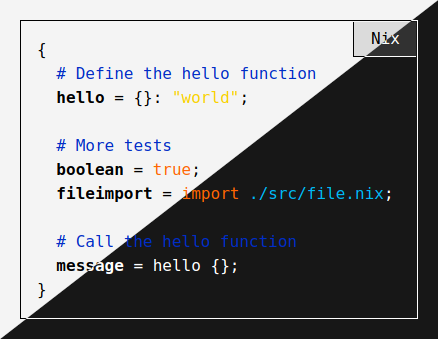
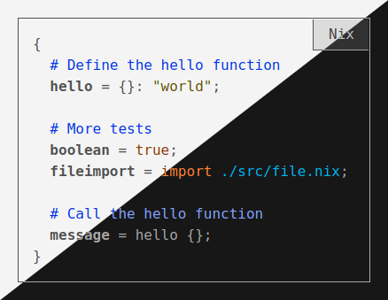

This blog is built with Emacs, SCSS using Nix and deployed as static files to
GitHub Pages. This blog also has quite some colors due to the syntax
highlighting for code that is performed using CSS rules on HTML classes.

So in total I have 15 different colors defined, in which four of them is
background and foreground colors, two of them is related to link and visited
link colors. Then I have nine colors remaining which are related to syntax
highlighting of code.

Colors like that can't just be used together with a good result, one have to
consider the different contrasts of colors against each other. I didn't feel
like making up all the colors for both the light and the dark background, I
wanted the same color-scheme for both themes. So what I did was to write a
SCSS function to adjust the color to get a specific contrast compared to the
background where it's supposed to be used.

So how do I use these colors is practice?

## Raw color themes

Raw color themes which have some colors with too little contrast and some with too much contrast:



## Adjusted contrast themes

Adjusted color themes which have all the colors contrast adjusted to the background:



## How is this accomplished at build time?

Mozilla has a page about [Color contrast](https://developer.mozilla.org/en-US/docs/Web/Accessibility/Understanding_WCAG/Perceivable/Color_contrast),
they also refer to [Web Content Accessibility Guidelines (WCAG) 2.1](https://www.w3.org/TR/WCAG21/#dfn-contrast-ratio). So there's a clear definition to how to
calculate the color contrast. It required a bunch of math and calculations to do a single comparison.

I've found some functions on the internet that already had been written that
I've improved upon. So I have the plain math functions in my [`math.scss`](https://github.com/etu/etu.github.io/blob/master/src/scss/math.scss)
file. With some additional functions to calculate the contrast I've found in
other places that resulted in a function named `contrast-color` located in
[`functions.scss`](https://github.com/etu/etu.github.io/blob/master/src/scss/functions.scss).

The usage of these functions is quite simple, here's a SCSS example:

```scss
@import "path/to/functions/file";

// Background colors to calculate the
// colors against.
$darkBackgroundColor: #171717;
$lightBackgroundColor: #F4F4F4;

// The foreground color to use against
// the background colors.
$codeKeywordColor: #FF256F;

// Define the color themes as CSS
// variables for the light theme.
:root {
  --background: #{$lightBackgroundColor};
  --code-keyword-color: #{contrast-color(
    $codeKeywordColor, $lightBackgroundColor)};
}

// Define the color themes as CSS
// variables for the dark theme.
@media (prefers-color-scheme: dark) {
  :root {
    --background: #{$darkBackgroundColor};
    --code-keyword-color: #{contrast-color(
      $codeKeywordColor, $darkBackgroundColor)};
  }
}

// Use the colors in your theme
div {
  background: var(--background);
  color: var(--code-keyword-color);
}
```

So now I can select key colors once and get a consistent color contrast of
about 7 on all of the colors on the page to not have some colors *screaming*
while others have too little contrast that makes them hard to read.
