Back in 2017, this fairly small company [Purism](https://puri.sm) launched a crowdfunding on
their own crowdfunding platform for their future phone known as [Librem 5](https://puri.sm/products/librem-5/). I
went back and forth a bit, I thought through some of the history about the
company and decided that I thought they may deliver some day. At least I
wanted to support the effort to make a modern Linux that could fill the hole
that the demise of the [Nokia N900](https://en.wikipedia.org/wiki/Nokia_N900) with no worthy device following up.

Some of the early history of Purism, if I recall correctly is that they ran a
crowdfunding for their first laptops, it got delayed, it had quality issues
but as far as I understood it, most of these issues were worked out and I had
at one point a chance to have hands on experiences with one of their laptops
for a bit and it wasn't bad.

A phone is a quite different beast to build than a laptop when it comes to
hardware compared to a laptop.

## Delays and more delays

I never expected them to fulfill their shipment date promise. It's a hardware
crowdfunding -- there will be delays. To be honest, I was never sure that
they would deliver anything at all. This belief was getting stronger and
stronger with time.

One thing they did during the wait that I thought was weird was to hire [Bryan Lunduke](https://twitter.com/bryanlunduke)
which in the past have been controversial within the Linux media
space, but as of recently been fairly quiet or well behaved. At least, that
guy was hired by Purism. One of the things he did at Purism was this
advertisement for their own Cloud Services called *Librem One*. Here's a link
to the advertisement on YouTube: [Librem One: We Don't Look At Your Junk](https://www.youtube.com/watch?v=V0a03NRpX3Y). This
video is not really in good taste.

Then there's been delays on parts, production, software, hardware,
production, hardware, production, certifications, testing, different batches,
more hardware, shipping, pandemics, outages of parts and a lot of different
reasons for delays.

## Delivery

Last Monday I got an email that they did ship it out (after actually
confirming the postal address some weeks before). It's now Friday and I
actually have the device right here by my side, faster delivery than
expected, but that's thanks to DHL rather than Purism. Purism had a delay of
1466 days between the confirmation email from the crowdfunding and the
shipment notification.

## First Impressions

Here I'll go through my first impressions from spending the evening playing
around with the device.

### Packaging

The box is super nice and neat. It has the Purism logo on the front side,
says /Librem 5/ on the bottom and top of the box, it's a nice black box with
white text. On the back of the box it clarifies that the box is recyclable,
[FCC](https://en.wikipedia.org/wiki/Federal_Communications_Commission), [CE Marking](https://en.wikipedia.org/wiki/CE_marking)
and a clarification of revision of the device *Librem 5 Version 1*.

Box contents (in order I got the items out):

- Quick start guide
- The Librem 5 device itself
- 18W PD3.0 US Wall plug (with two adapters, one for EU and one for UK)
- USB-C to USB-C cable
- SIM Card Removal tool
- In-Ear wired headphones (with a strong smell of flame retardant)

### Wall plug & USB-cable

I find the wall plug to be one of the more clever variants that I've seen for
a good while, the main adapter part has the US sticks that can be folded out,
but if I don't fold it out I can mount the EU or the UK plug on it. So it's
just two adapter bits rather than three.

The USB-C cable seems to be really nice quality.

### The Librem 5 hardware

The overall device feel is super rigid even though it's quite plastic.

Some observations on the hardware:

- We got three kill switches:
  - Modem
  - WLAN/Bluetooth
  - Camera/Microphone
  - Plus the additional weirdness: Disabling all three disables GPS
- Headphone jack
- USB-C Port
- Removable back-cover
- Removable battery
- Solid volume buttons
- Solid power button
- The bezels of the screen is perfectly fine
- I kinda like the feel and sturdiness
- The device is *thick*:
  - It's about the same thickness as… two modern phones piled on top of
    each other
  - It's about as thick as my N900, but then it lacks the slide out keyboard
  - It's also about as thick as a [Neo FreeRunner](https://en.wikipedia.org/wiki/Openmoko#Neo_FreeRunner)

So hardware wise, I'm split on what I think. The hardware is super dated by
now, it doesn't come close to what one could expect for $599 plus $185 in
import taxes and fees.

### The PureOS phone software

The device has an (by default) encrypted ext4 partition, so on boot one have
to enter a password for the drive, this wasn't mentioned in the quick start
guide. What was mentioned in the quick start guide was that one has to unlock
the screen with the default pass code `123456`. However, that default code
worked for the disk encryption as well.

A fun thing to see was that one gets to see the `getty` login prompt while
waiting for the `phosh` session to load which seems to run fine on Wayland.

Then I got an initial set up which prompted me to set up keyboard layout and
WiFi details among other things.

#### Some photos of the device in use

##### Had some problem downloading updates in the GUI application

Failure to download upgrades from the store:

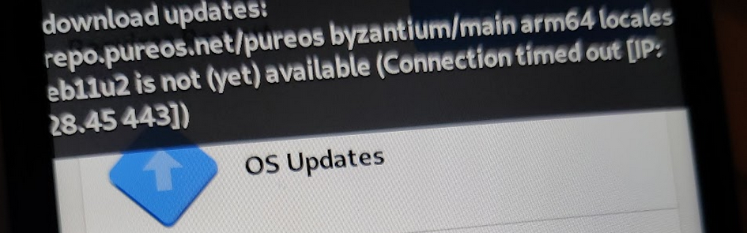

##### However, upgrading using `apt` in the terminal worked fine though

Successful upgrade using ~apt~ in the terminal:

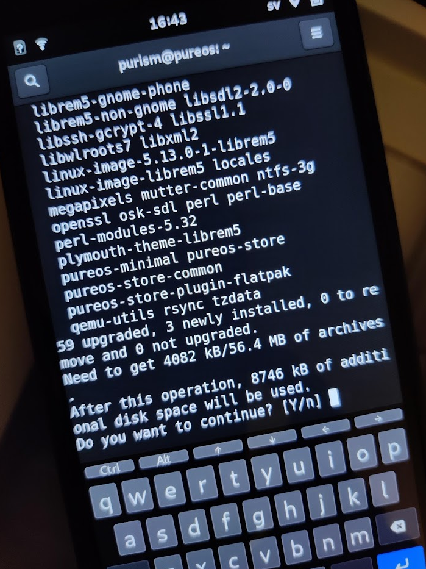

##### Kernel version

It's using a 5.13.0 mainline kernel:

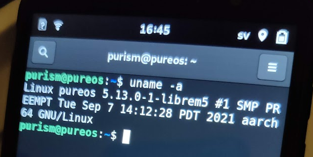

##### Mounted filesystems

We have a two partition layout with ext2 boot and encrypted ext4 root

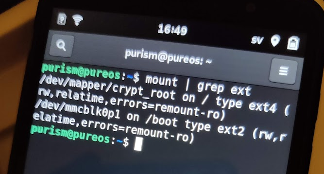

##### App drawer and workspace

Searchable app drawer seems to be the main workspace:

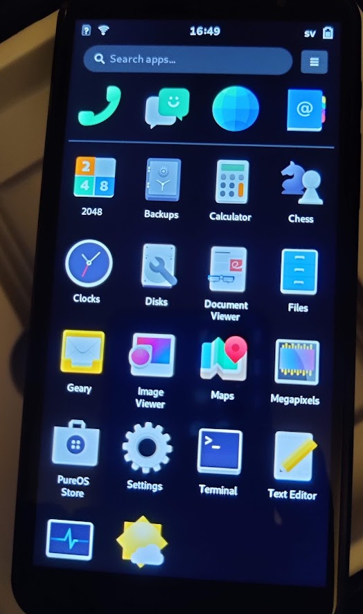

##### Browser

Web browser with my website, defaults to blocking ads and tracking:

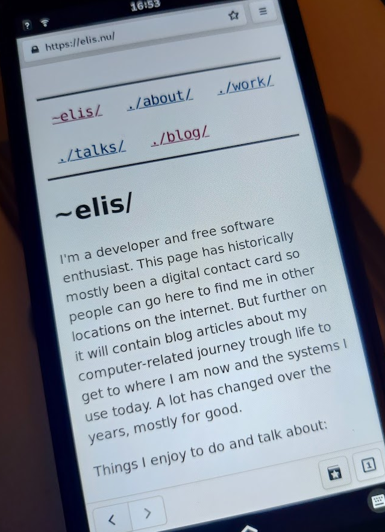

##### App drawer and switcher

App drawer when having apps running also shows the app switcher on top:

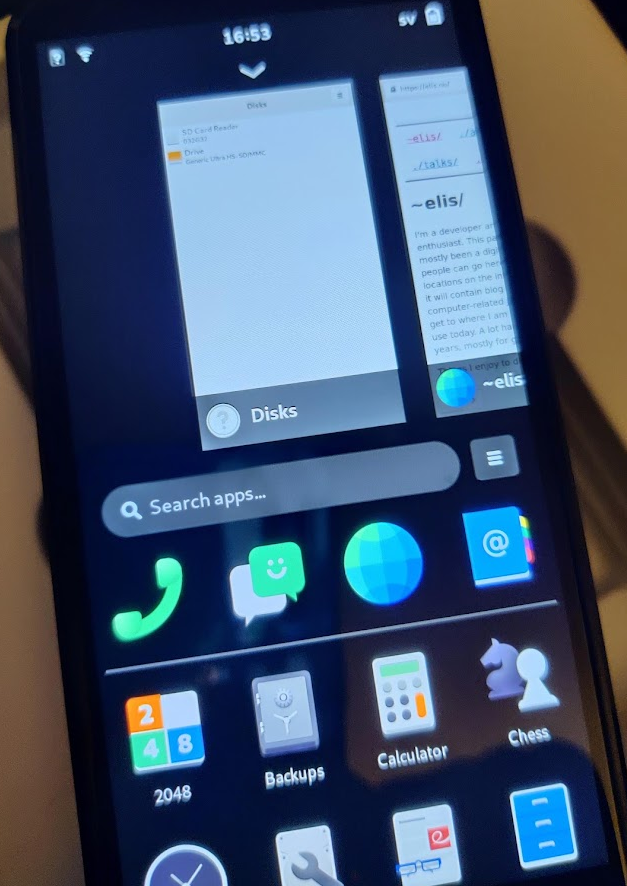

##### Camera live preview

Camera preview before taking a photo is super dark, even in bright light:

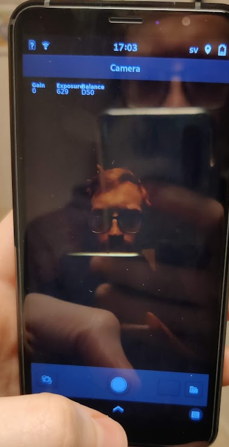

##### Resulting photo

Resulting photo is better than the preview, but nowhere close to what anyone would like to use:

##### Reference in same light and place with my OnePlus Nord

Reference photo in the same light taken with a OnePlus Nord:

##### Swedish Dvorak seems to be… QWERTY

The Swedish Dvorak layout known as Svorak has the same layout as Swedish Qwerty:

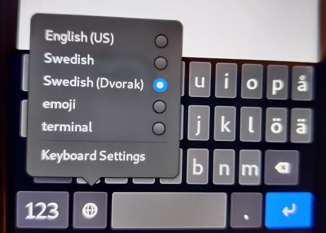

##### Emoji keyboard

The emoji keyboard is split up in pages and is mostly randomly organized
which makes it hard to navigate. One can probably learn which page your
favorite emoji is.

Emoji Keyboard with numeric paginations to find other emojis:

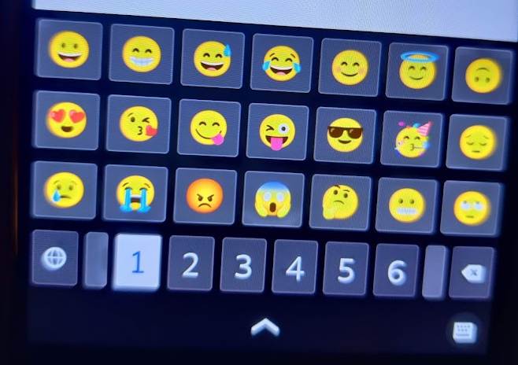

##### XMPP client

The XMPP client seems to fail on encryption in non encrypted chats to other
people, in chat rooms it seems fine:

XMPP client complaining about encryption errors in an un-encrypted chat:

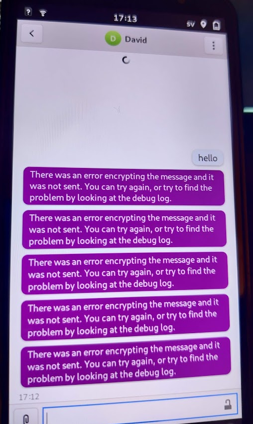

##### Apparently this phone thinks it's a laptop

Notification regarding critically low battery saying that the "Laptop" battery is low:

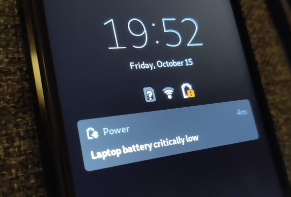

## Summary of first impressions

Part of me quite like the interface, but it's fairly slow. Scroll performance
isn't great, and I only tested on my own website which it didn't load any
javascript on… So it should be a fairly lightweight website and still
wasn't great.

The camera though, the camera is horrendous. I've never seen such a bad
camera in my entire life. This includes some of the 0.3 megapixel webcams
that existed around 2006.

They… have a lot to work on to get this to a usable state.
