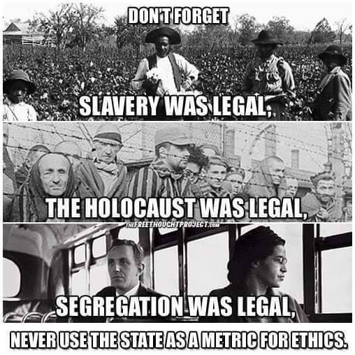

This is a follow-up on: [Why I use Free Software](/blog/2021/01/why-i-use-free-software/). This has been followed up
by: [I find food habits at Free Software events weird](/blog/2021/01/i-find-food-habits-at-free-software-events-weird/).

People who turn to [Veganism](https://en.wikipedia.org/wiki/Veganism#Ethical_veganism) can do this for different reasons,
some do it for health reasons, others for climate reasons. But in it's core,
the Vegan movement in itself is an ethical movement about saving the animals.
The other reasons are more or less side effects.

When my journey to Veganism started I didn't get into Veganism at all to
begin with. I got into [Vegetarianism](https://en.wikipedia.org/wiki/Vegetarianism) because wanted to
challenge myself by forcing myself to change and experience a different
pallet of foods, but also for health reasons.

Over time I've learned more about the ethical aspects of Veganism which
partly made me question the point of Vegetarianism and more towards ethical
Veganism. I still to this day don't know the point of Vegetarianism, not
after learning some of the horrible things that happens within the dairy
industry.

Before I became a Vegan I thought that I was doing something good for the
animals and the environment. How bad can milk be ([Youtube - Erin Janus - Dairy is scary!](https://www.youtube.com/watch?v=UcN7SGGoCNI))? How bad
can wool be ([Youtube - Erin Janus - Wool industry exposed](https://www.youtube.com/watch?v=siTvjWE2aVw))? It also turns out that the best thing anyone
can do for the environment ([The Guardian: Avoiding meat and dairy is ‘single biggest way’ to reduce your impact on Earth][https://www.theguardian.com/environment/2018/may/31/avoiding-meat-and-dairy-is-single-biggest-way-to-reduce-your-impact-on-earth])  is also the best thing for the animals.

Before I started this journey into Veganism I was the typical meat eating
guy. I even used to make inappropriate jokes like this:

> Pig bacon on Cow burgers is good because that insures that at least two
> different animals have died for this meal.

This was a morbid joke back then, it hasn't aged well. I'm also upset with
myself that I didn't learn and actually adopted Veganism as a lifestyle
earlier - but I know for a fact that I wouldn't listen, I know this because
my partner tried to convince me to drop milk earlier. I simply refused. I
believe that everyone have to get there in their own way in their own time
when they understand why.

So to conclude, for all the reasons stated here (and more), I find Veganism
to be the only reasonable lifestyle that is actually the only one that
doesn't have the intent to outsource murder in gas chambers (among other
methods) and rape to feed the murder.

Even though It's been many years since I got hooked on using [Free Software](/blog/2021/01/why-i-use-free-software/),
I've now made the mental connection between Free Software and Veganism since
I've found that they are surprisingly similar.

There's some key differences though. [Proprietary Software](https://en.wikipedia.org/wiki/Proprietary_software) usually doesn't involve:

- Killing of billions of animals including using actual gas chambers.
- Breed the animals to be able to kill them.
- Produce toxic waste from having millions of sentient beings in the form of
  feces that comes out in the water supplies.

Veganism is the only humane lifestyle that isn't pushing for more
[Speciesism](https://en.wikipedia.org/wiki/Speciesism), which benefits both humans, animals and the
environment. Since Free Software is humane software, I can only conclude that
Free Software is Vegan software - but a less important issue due to the
victims that Veganism wants to protect.
