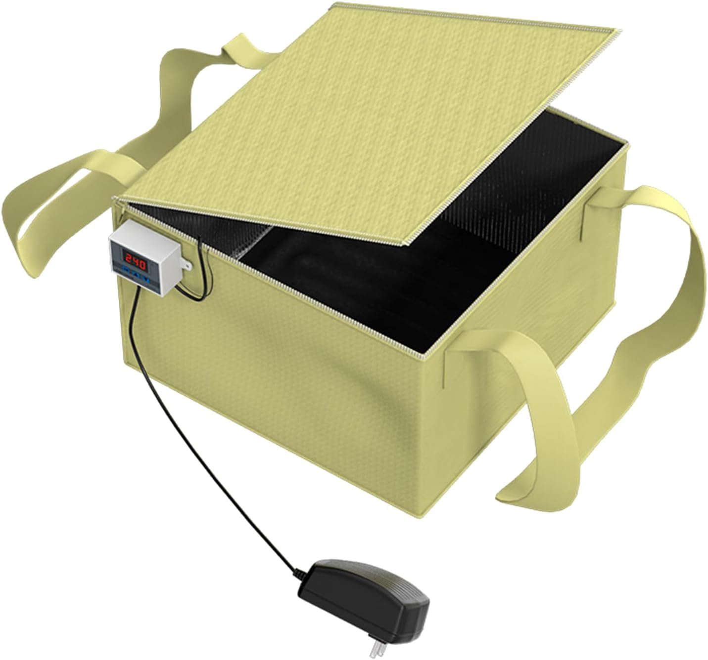
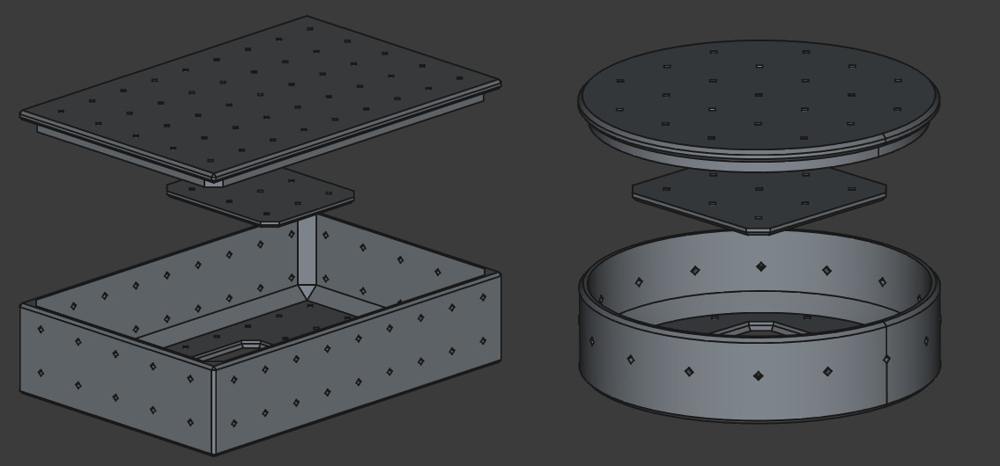

Tempeh. Ever heard of it? It’s a traditional Indonesian food made from
fermented soybeans. Packed with protein and a unique nutty flavor,
tempeh is a fantastic meat substitute for vegans and vegetarians
alike.

In this post, I’ll guide you through what tempeh is, how to make it at
home, and tackle some of the common challenges, like maintaining the
right fermentation temperature. So, if you’ve ever thought about
giving tempeh-making a try, let’s dive in!

---

## What is Tempeh?

Tempeh is made by fermenting beans with a fungal culture called
[Rhizopus oligosporus](https://en.wikipedia.org/wiki/Rhizopus_oligosporus). As
the fungus grows, it binds the beans into a firm cake, which can be
sliced, marinated, and cooked in countless ways.

The process is straightforward in theory: soak, cook, and ferment the
beans. However, keeping the temperature stable during fermentation can
be tricky. But don’t worry, I’ll share my solutions below!

Make sure to be ready to tackle [The Temperature
Problem](#the-temperature-problem) and get creative with [Molds and
Shapes](#molds-and-shapes) for your tempeh.

---

## How to Make Tempeh

### Ingredients

- **500g dried, dehulled soybeans**
  (Other beans work too, dehulled and split lupin beans are a great alternative!)

  *Source: [Mellins 🇸🇪](https://mellins.nu/produkter/skafferi-torrvaror-smaksattning/baljvaxter/bonor/sojabonor-skalade-obesprutade/)*

- **5ml (1 tsp) tempeh starter**

  *Source: [Humlegårdens Ekolager 🇸🇪](https://shop.humle.se/jast/fermentering/tempeh-starter-25-gram)*

- **75ml (5 tbsp) apple cider vinegar**

### Instructions

#### 1. Prepare the Beans

1. Soak the beans in water for at least 8 hours or overnight.
2. Rinse them thoroughly with fresh water.
3. Boil the beans over low heat for 40–45 minutes, until soft but not
   mushy.

#### 2. Dry and Cool the Beans

4. Drain the beans well, then return them to the pot. Heat gently to
   remove excess water without burning them.
5. Mix in the apple cider vinegar.
6. Spread the beans out on a baking tray to cool to below 30°C (86°F).

#### 3. Add the Starter

7. Once cooled, mix in the tempeh starter evenly.

#### 4. Shape the Tempeh
8. Pack the beans into molds or shapes of your choice. (See [Molds and
   Shapes](#molds-and-shapes) for ideas.)

#### 5. Ferment
9. Place the molds in a heating box or other temperature-controlled
   environment. Elevate the molds slightly to allow airflow.
10. Check the tempeh after 20 hours—it should start to develop white
    mold. Allow it to ferment for another 10–15 hours.

💡 **Note:** Small traces of black mold are normal and not harmful.

---

## Troubleshooting & Tips

### The Temperature Problem

Maintaining the right temperature (30–31°C / 86–88°F) during
fermentation can be tricky. I tried building a DIY heating box, but it
was unreliable. Eventually, I discovered a "bread proofer box," which
works perfectly.

Here’s how I use mine:

- **Start Temp (P0):** 29.5°C (85.1°F)
- **Stop Temp (P1):** 31°C (87.8°F)
- **Calibration (P2) and Delay-Start (P3):** Both set to 0.

When placing the tempeh in the box, I add chopsticks beneath the molds
to ensure even heat distribution. I also position the temperature
probe near the heating mat.

*Bread Proofer Box from [Amazon](https://www.amazon.se/dp/B085HTJ8LL)*

---

### Molds and Shapes

Traditionally, tempeh is wrapped in banana leaves, but these aren’t
easily available in my area. Instead, I use two methods:

1. **Perforated Zip-lock Bags**
   - Create evenly spaced holes with a fork or toothpick.

2. **3D-Printed Molds**
   - I designed and printed custom molds for different tempeh
     shapes. [3D model designs](https://makerworld.com/en/collections/3581445).
   - These aren’t food-safe but work well for personal use. If you try
     this, use your own judgment.

For inspiration, check out this
[Wikifactory collection](https://wikifactory.com/@domingoclub/tempeh-molds).

---

## Final Thoughts

Making tempeh at home is rewarding, nutritious, and surprisingly fun
once you’ve got the process down. Whether you’re experimenting with
different beans or troubleshooting temperature issues, the journey is
worth it.

If you have any questions, feel free to leave a comment below. Happy
fermenting!

---

## Resources

- [What is Tempeh?](https://en.wikipedia.org/wiki/Tempeh)
- [Soy beans from Mellins](https://mellins.nu/produkter/skafferi-torrvaror-smaksattning/baljvaxter/bonor/sojabonor-skalade-obesprutade/)
- [Tempeh Starter from Humlegården](https://shop.humle.se/jast/fermentering/tempeh-starter-25-gram)
- [Bread Proofer Box on Amazon](https://www.amazon.se/dp/B085HTJ8LL)
